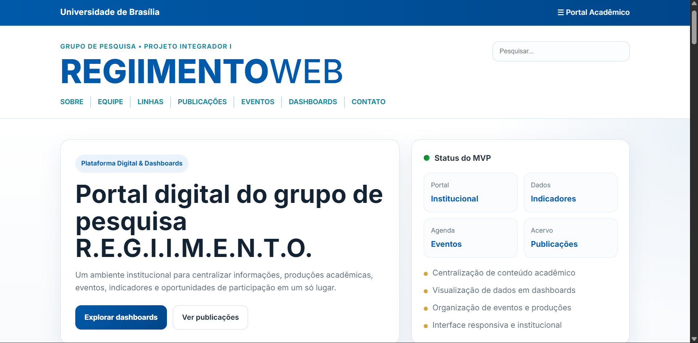
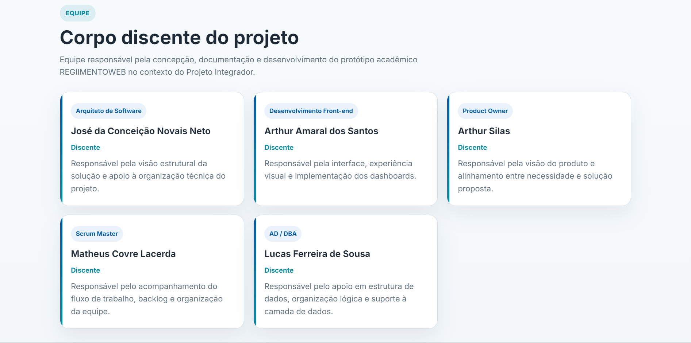
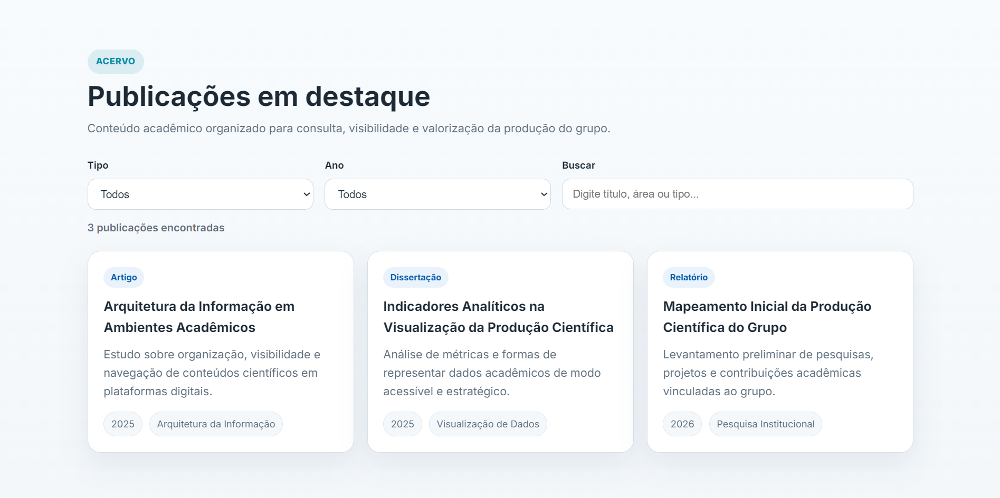
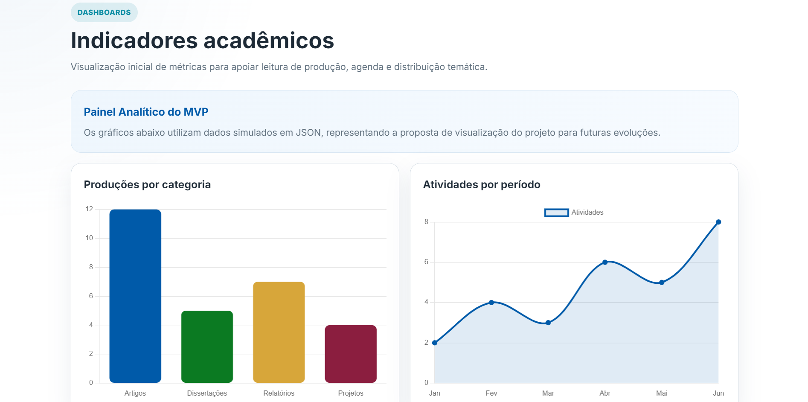
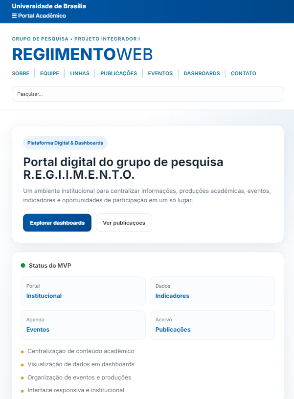

# 📂 Projeto R.E.G.I.I.M.E.N.T.O. - Plataforma Digital & Dashboards

**Status do Projeto:** 🛠️ Em Desenvolvimento (Protótipo Acadêmico)  
**Instituição Parceira:** Grupo de Pesquisa R.E.G.I.I.M.E.N.T.O. (UnB / INTERPARES TRUST AI)  
**Disciplina:** Projeto Integrador I - ADS (CEUB)

---

## 📌 Sobre o Projeto

Este projeto consiste no desenvolvimento de um protótipo de plataforma digital para o grupo de pesquisa **R.E.G.I.I.M.E.N.T.O.**, vinculado à Universidade de Brasília (UnB).

A proposta da solução é centralizar informações institucionais, pesquisas, publicações, eventos e dados analíticos em um único ambiente digital, facilitando o acesso para estudantes, pesquisadores, docentes e comunidade acadêmica.

O foco principal do projeto é apoiar a divulgação da produção científica do grupo, que atua em áreas como **Ciência Arquivística Computacional (CAS), Arquitetura da Informação Multimodal (MIA), Processamento de Linguagem Natural, Engenharia de Ontologias, Multimodalidade e Deep Learning**.

Além disso, a plataforma busca transformar dados estatísticos complexos em visualizações interativas (**dashboards**), promovendo melhor comunicação entre o grupo e a sociedade, além de incentivar o engajamento de novos pesquisadores e voluntários.

---

## ❗ Problema

Atualmente, informações sobre o grupo, suas pesquisas, eventos, produções acadêmicas e indicadores analíticos podem estar dispersas ou com difícil acesso.

Isso pode causar:

- dificuldade para localizar informações relevantes;
- menor visibilidade das ações e pesquisas do grupo;
- dificuldade no engajamento de novos estudantes e pesquisadores;
- comunicação menos eficiente com a comunidade acadêmica e a sociedade.

**Problema central:** ausência de uma plataforma digital centralizada, clara, moderna e responsiva para divulgação e acesso às informações do grupo.

---

## 🎯 Objetivo Geral

Desenvolver uma plataforma digital responsiva para o grupo **R.E.G.I.I.M.E.N.T.O.**, com foco em:

- centralização de informações institucionais;
- divulgação de pesquisas, eventos e publicações;
- apresentação de dashboards acadêmicos e analíticos;
- fortalecimento da comunicação com a comunidade acadêmica;
- incentivo à participação de novos estudantes, voluntários e pesquisadores.

---

## 🎯 Objetivos Específicos

- Criar uma página institucional com histórico e apresentação do grupo;
- Exibir linhas de pesquisa e áreas de atuação;
- Disponibilizar informações sobre corpo docente e discente;
- Organizar um repositório de teses, dissertações, artigos e produções acadêmicas;
- Divulgar workshops, colóquios, seminários e demais eventos;
- Criar uma área para alunos e interessados;
- Integrar dashboards para visualização de dados relacionados à Arquitetura da Informação Multimodal no Brasil.

---

## 🚀 Funcionalidades do Protótipo

- ✅ **Portal Institucional:** apresentação do histórico do grupo, linhas de pesquisa e corpo docente/discente;
- ✅ **Repositório Dinâmico:** listagem de teses, dissertações, artigos e produções acadêmicas;
- ✅ **Dashboards de Dados:** painéis interativos com dados e indicadores acadêmicos;
- ✅ **Agenda de Eventos:** divulgação de workshops, colóquios e seminários;
- ✅ **Área para Interessados:** espaço voltado para estudantes e pesquisadores interessados no grupo;
- ✅ **Interface Responsiva:** adaptação para desktop e dispositivos móveis.

---

## 👥 Público-Alvo

Este projeto é voltado para:

- estudantes interessados em pesquisa;
- pesquisadores e professores;
- integrantes do grupo REGIIMENTO;
- comunidade acadêmica;
- sociedade interessada em ciência, tecnologia e educação digital.

---

## 🤝 Stakeholders

Os principais stakeholders do projeto são:

- professores responsáveis e gestores do projeto;
- integrantes do grupo REGIIMENTO;
- estudantes interessados em participar de pesquisas;
- pesquisadores e comunidade acadêmica;
- Universidade de Brasília (UnB);
- parceiros institucionais;
- sociedade em geral.

---

## 🛠️ Stack Tecnológica

Para este MVP, foram priorizadas ferramentas que equilibram simplicidade, desempenho e agilidade no desenvolvimento:

- **Frontend:** HTML, CSS, Tailwind CSS
- **Lógica e Visualização:** JavaScript (ES6) + Chart.js
- **Gestão de Dados:** JSON
- **Versionamento:** Git e GitHub
- **Deploy:** Vercel / GitHub Pages

---

## 📋 Requisitos Iniciais

### Requisitos Funcionais
- O sistema deve exibir informações institucionais do grupo;
- O sistema deve apresentar as linhas de pesquisa;
- O sistema deve listar publicações e produções acadêmicas;
- O sistema deve divulgar eventos e atividades;
- O sistema deve apresentar dashboards com indicadores analíticos;
- O sistema deve oferecer uma navegação clara e intuitiva.

### Requisitos Não Funcionais
- O sistema deve ser responsivo;
- O sistema deve possuir interface clara e acessível;
- O sistema deve apresentar boa usabilidade;
- O sistema deve seguir uma organização visual intuitiva;
- O sistema deve facilitar o acesso às informações acadêmicas.

---

## 📌 Backlog Inicial

- [x] Criar identidade visual inicial do projeto
- [x] Definir arquitetura da informação
- [x] Criar página inicial
- [x] Criar página institucional
- [x] Criar seção de linhas de pesquisa
- [x] Criar seção de publicações
- [x] Criar agenda de eventos
- [x] Criar área para interessados
- [x] Criar dashboards acadêmicos
- [x] Tornar a interface responsiva

---

## 👥 Equipe e Responsabilidades

| Integrante | Função | Atribuições |
|---|---|---|
| José Neto | Arquiteto de Software | Estrutura técnica, escalabilidade e integração |
| Lucas Ferreira | AD / DBA | Modelagem de dados e estruturação das estatísticas |
| Arthur Amaral | Dev Team (Front) | Desenvolvimento da interface e lógica dos gráficos |
| Matheus Covre | Scrum Master | Gestão de sprints e metodologias ágeis |

---

## 🧠 Metodologia

O projeto será conduzido com base em conceitos de **Scrum** e **Design Thinking**, utilizando etapas como:

- empatia;
- definição do problema;
- criação de persona;
- jornada do usuário;
- brainstorming de soluções;
- definição de backlog e escopo inicial.

---

## 🖼️ Capturas do Sistema

### Página inicial


### Seção de equipe


### Publicações com filtros


### Dashboard


### Responsividade


---

## 📁 Estrutura do Projeto

```text
Projeto-Integrador/
├── index.html
├── assets/
│   ├── css/
│   │   └── style.css
│   ├── js/
│   │   └── dashboard.js
│   ├── data/
│   │   ├── indicadores.json
│   │   ├── publicacoes.json
│   │   ├── eventos.json
│   │   └── equipe.json
│   └── img/
├── docs/
│   ├── 02_Arquitetura.pdf
│   ├── 03_Backlog.pdf
│   ├── 04_Canvas.pdf
│   ├── 05_Jornadas.pdf
│   ├── 06_MVP.pdf
│   ├── 07_Personas.pdf
│   ├── 08_Portfólio.pdf
│   ├── 09_Requisitos.pdf
│   ├── 10_Visão e Plano.pdf
│   ├── 11_Visão do Produto.pdf
│   ├── Ata-De-Validacao.md
│   ├── AzureDevOps.pdf
│   ├── Historias-De-Usuario.md
│   └── Testes.md
└── README.md
